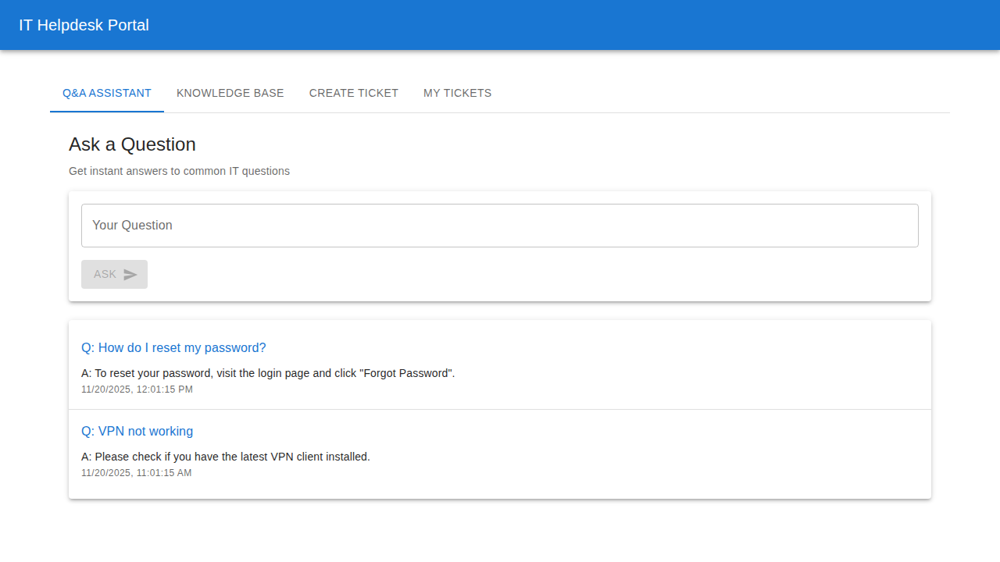
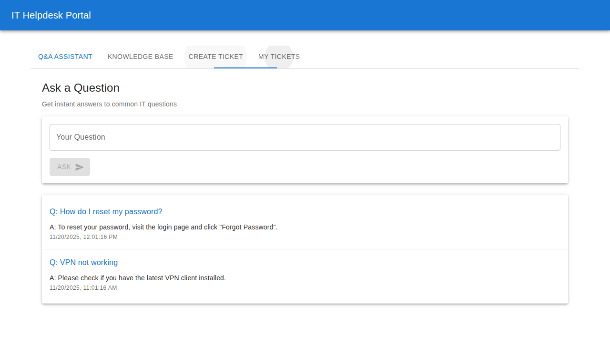
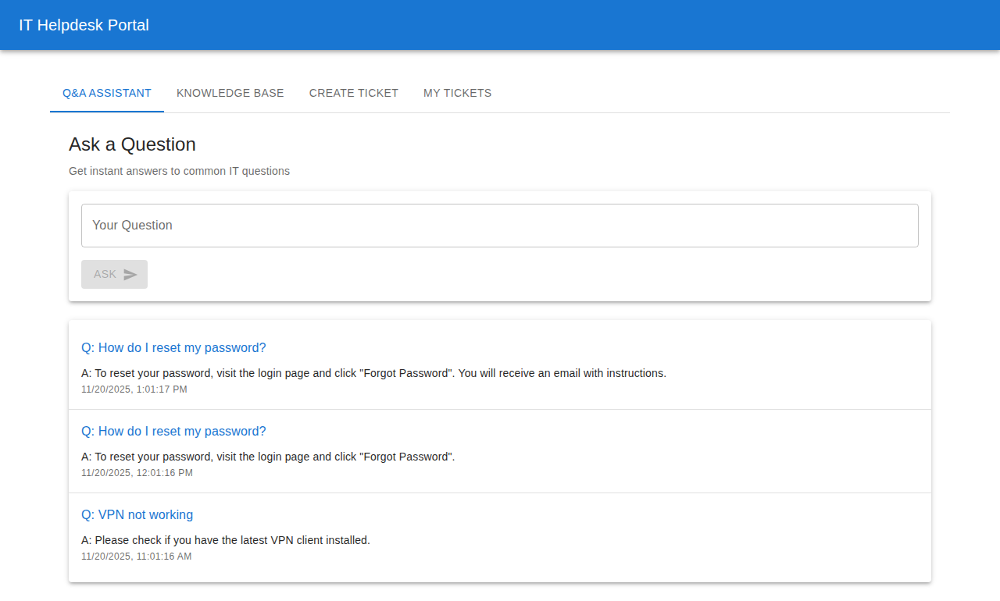
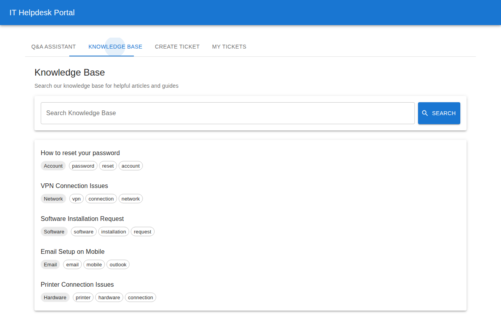
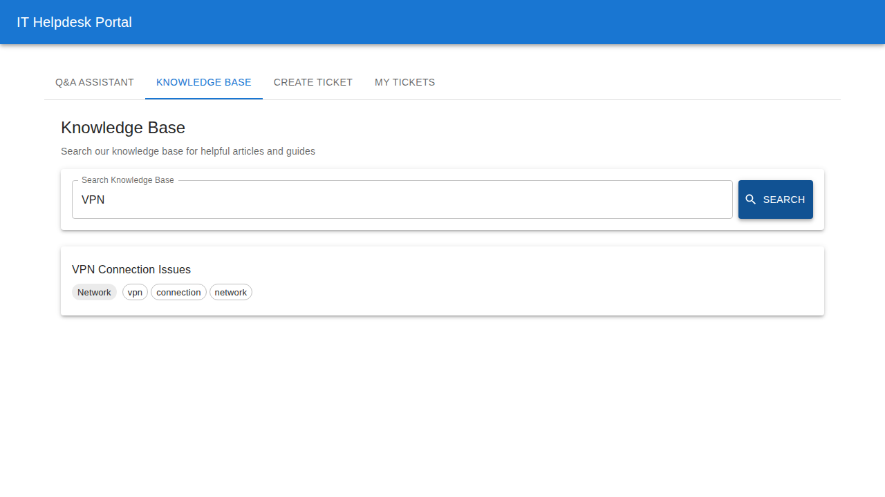
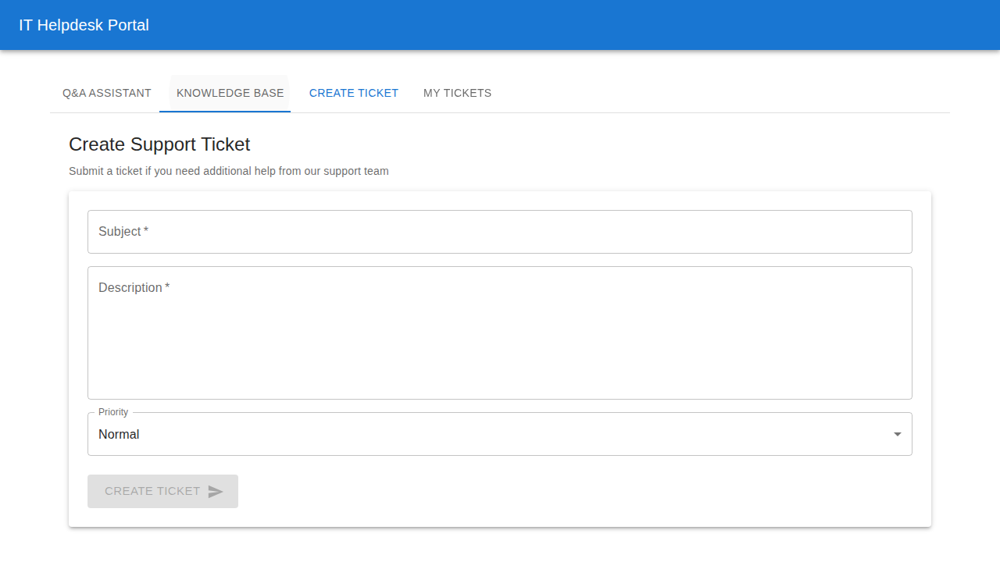
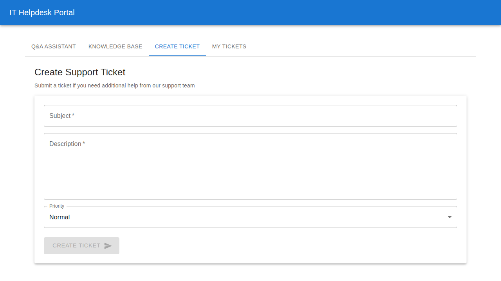
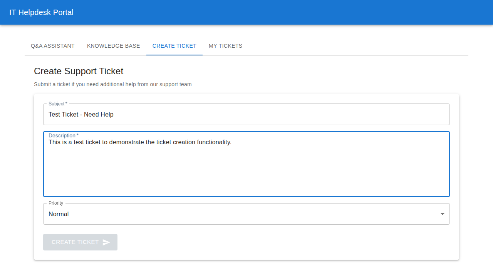
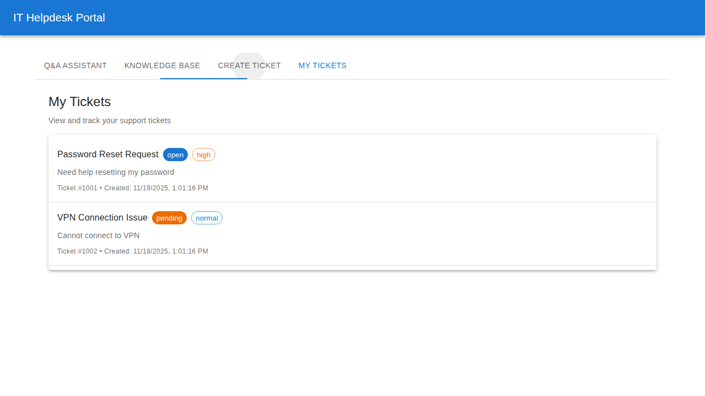
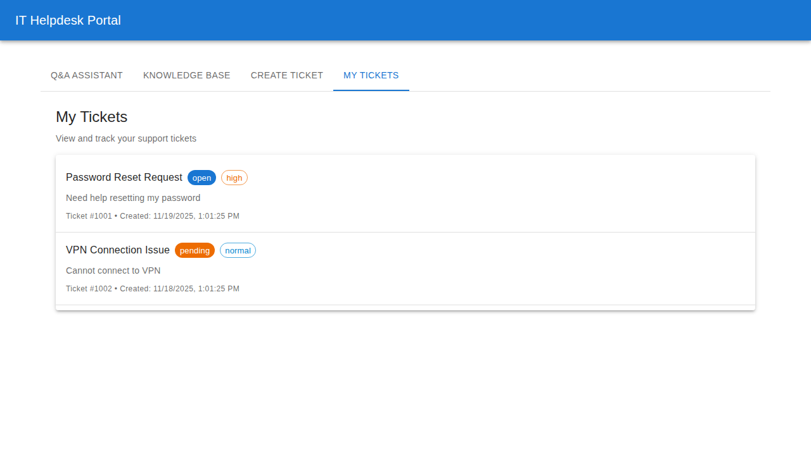

# IT Helpdesk Application Screenshots

This document showcases the key features of the IT Helpdesk web application through screenshots captured during automated testing.

## Homepage / Login

The main landing page of the IT Helpdesk Portal showing the clean, modern interface.

---

## Q&A Assistant Tab

The Q&A assistant interface where users can ask common IT questions.

Detailed view of the question input interface.

Example of the Q&A assistant providing an answer to a password reset question.

---

## Knowledge Base

The knowledge base interface showing available articles organized by category and tags.

Search results displaying relevant articles filtered by VPN keyword.

---

## Ticket Creation

The ticket creation interface.

Initial state of the ticket creation form.

Example of a completed ticket form ready for submission.

---

## My Tickets

Overview of the My Tickets interface.

Detailed view showing existing tickets with their status and priority levels.

---

## Key Features Demonstrated

1. **Modern UI Design**: Clean, responsive Material-UI components
2. **Tab Navigation**: Easy switching between different features
3. **Interactive Q&A**: Real-time question and answer functionality
4. **Searchable Knowledge Base**: Quick access to help articles
5. **Ticket Management**: Create and track support tickets
6. **Status Indicators**: Visual priority and status badges
7. **Form Validation**: User-friendly form inputs with proper labels

All screenshots were automatically captured using Playwright E2E tests, ensuring that every feature is tested and documented.
