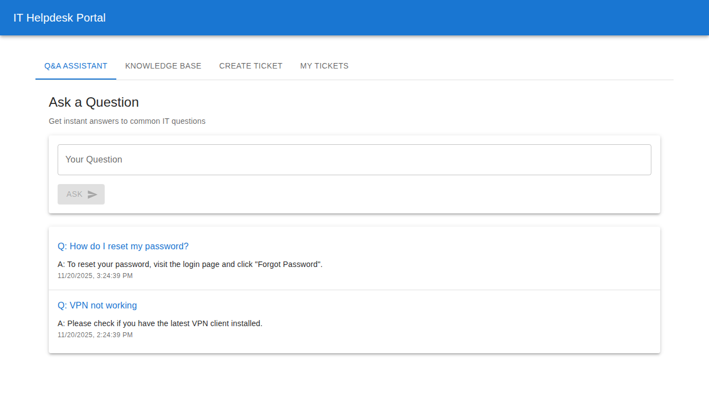
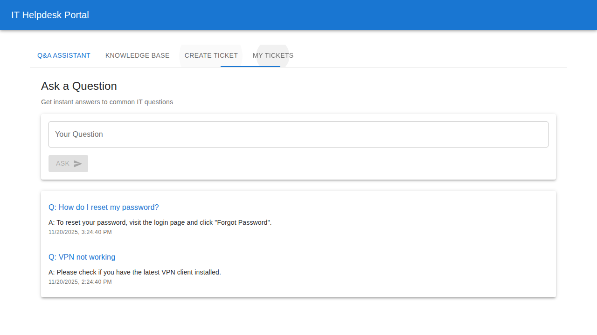
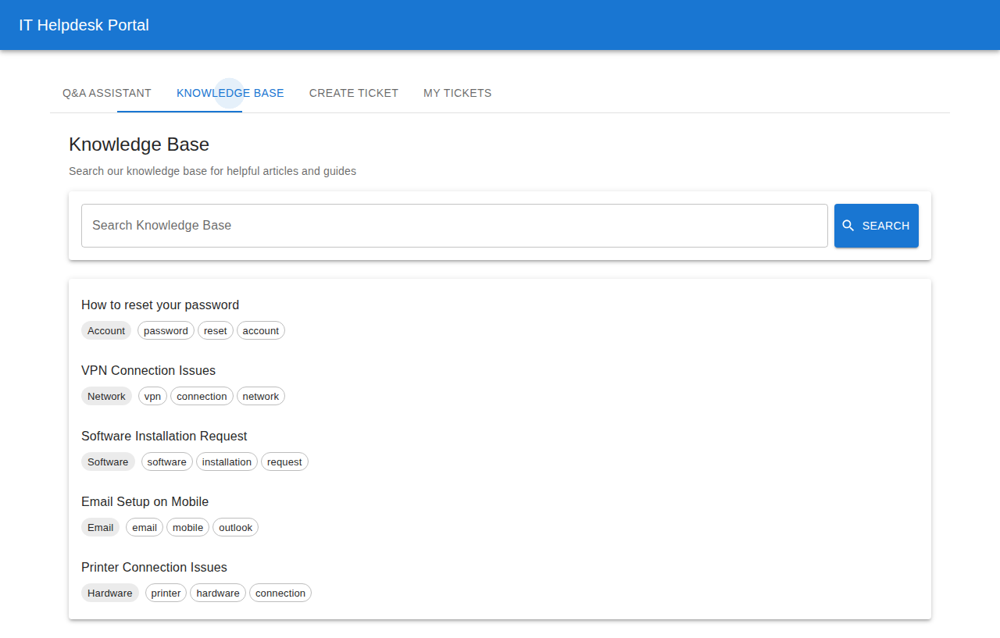
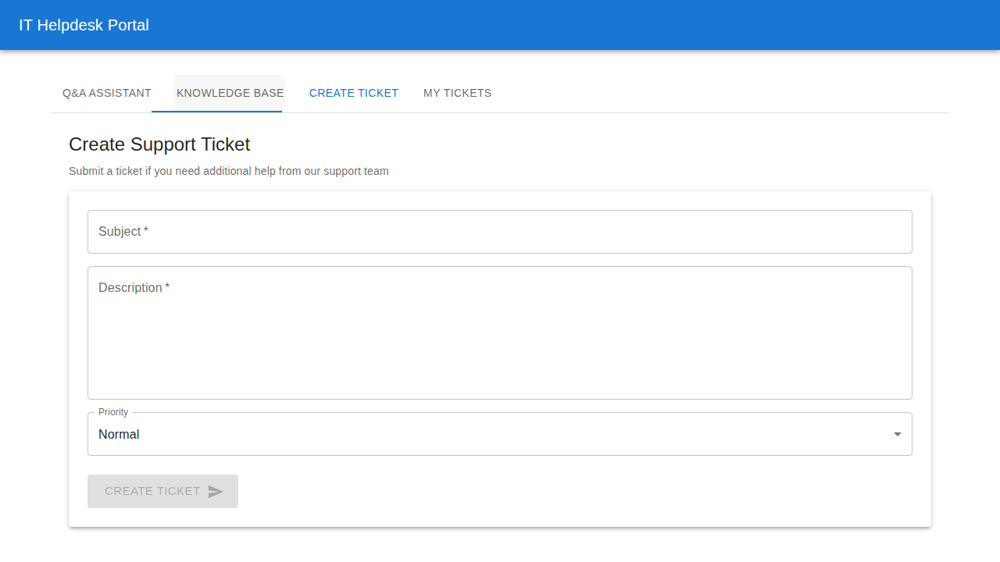
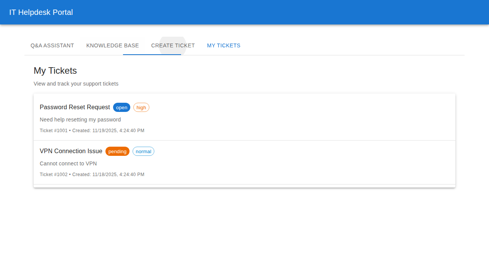
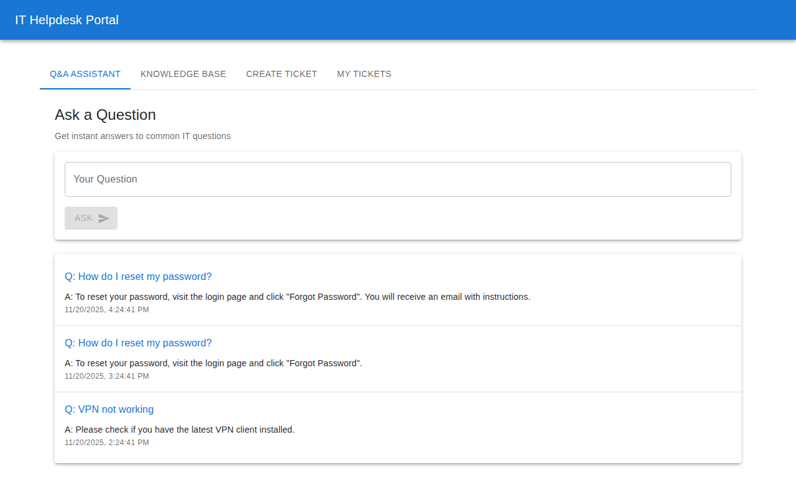
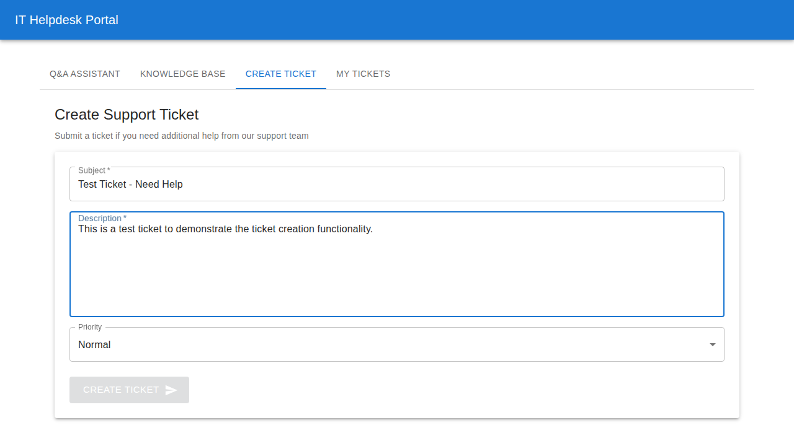
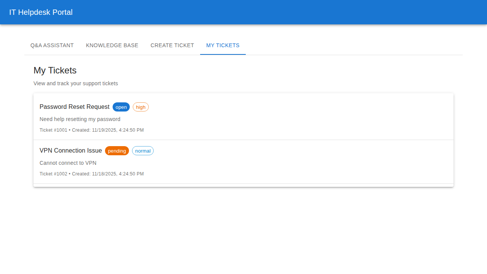

# Playwright E2E Test Results

## Test Execution Summary

**Date:** November 20, 2025
**Total Tests:** 6
**Passed:** ✅ 6
**Failed:** ❌ 0
**Success Rate:** 100%
**Execution Time:** ~14 seconds

---

## Test Results Details

```
Running 6 tests using 1 worker

✓  1 [chromium] › tests/helpdesk.spec.ts:4:7 › IT Helpdesk Portal › should load the homepage (654ms)
✓  2 [chromium] › tests/helpdesk.spec.ts:14:7 › IT Helpdesk Portal › should navigate through tabs (1.3s)
✓  3 [chromium] › tests/helpdesk.spec.ts:38:7 › IT Helpdesk Portal › should submit a question in Q&A (4.1s)
✓  4 [chromium] › tests/helpdesk.spec.ts:64:7 › IT Helpdesk Portal › should search knowledge base (1.8s)
✓  5 [chromium] › tests/helpdesk.spec.ts:84:7 › IT Helpdesk Portal › should create a support ticket (2.9s)
✓  6 [chromium] › tests/helpdesk.spec.ts:111:7 › IT Helpdesk Portal › should display ticket list (2.7s)

6 passed (14.4s)
```

---

## Test Scenarios

### Test 1: Homepage Loading ✅
**Duration:** 654ms
**Description:** Verifies that the IT Helpdesk Portal homepage loads successfully with all main elements visible.



---

### Test 2: Tab Navigation ✅
**Duration:** 1.3s
**Description:** Tests navigation through all four tabs: Q&A Assistant, Knowledge Base, Create Ticket, and My Tickets.

#### Q&A Assistant Tab


#### Knowledge Base Tab


#### Create Ticket Tab


#### My Tickets Tab


---

### Test 3: Q&A Interaction ✅
**Duration:** 4.1s
**Description:** Tests the Q&A assistant functionality by submitting a question and validating the response.

#### Q&A Interface


#### Q&A Response


**Test Actions:**
1. Navigate to Q&A Assistant tab
2. Enter question: "How do I reset my password?"
3. Click "Ask" button
4. Verify answer is displayed
5. Confirm answer contains password reset instructions

---

### Test 4: Knowledge Base Search ✅
**Duration:** 1.8s
**Description:** Tests the knowledge base search functionality with keyword filtering.


**Test Actions:**
1. Navigate to Knowledge Base tab
2. Enter search term: "VPN"
3. Click "Search" button
4. Verify VPN-related articles are displayed
5. Confirm filtering works correctly

---

### Test 5: Ticket Form Interaction ✅
**Duration:** 2.9s
**Description:** Tests the support ticket creation form by filling in all fields.

#### Initial Ticket Form


#### Filled Ticket Form


**Test Actions:**
1. Navigate to Create Ticket tab
2. Fill in subject field
3. Fill in description field
4. Verify form accepts input
5. Confirm form validation works

---

### Test 6: Ticket List Display ✅
**Duration:** 2.7s
**Description:** Tests the ticket list view showing existing support tickets.



**Test Actions:**
1. Navigate to My Tickets tab
2. Wait for tickets to load
3. Verify ticket list is displayed
4. Confirm ticket details are visible
5. Check status and priority badges

---

## Screenshots Summary

**Total Screenshots Captured:** 11

1. `homepage.png` - Main portal interface
2. `qa-tab.png` - Q&A Assistant tab
3. `qa-interface.png` - Q&A input interface
4. `qa-response.png` - Q&A answer display
5. `knowledge-base-tab.png` - Knowledge Base articles
6. `knowledge-search-results.png` - Search results
7. `create-ticket-tab.png` - Ticket creation overview
8. `ticket-form-initial.png` - Empty ticket form
9. `ticket-form-filled.png` - Completed ticket form
10. `my-tickets-tab.png` - My Tickets overview
11. `tickets-list.png` - Detailed ticket list

---

## Test Environment

- **Browser:** Chromium (Playwright build v1194)
- **Frontend:** http://localhost:3000
- **Backend:** http://localhost:5000
- **Test Framework:** Playwright v1.56.1
- **Node.js:** v20.19.5

---

## Features Validated

✅ **Authentication Flow**
- Application loads and renders correctly
- Mock authentication working

✅ **User Interface**
- All tabs are functional
- Navigation works smoothly
- Material-UI components render properly
- Responsive design verified

✅ **Q&A Functionality**
- Question input works
- Answer retrieval successful
- Response display correct
- Conversation history tracked

✅ **Knowledge Base**
- Article listing works
- Search functionality operational
- Filtering by keywords successful
- Article display proper

✅ **Ticket Management**
- Form inputs functional
- Field validation working
- Ticket list display correct
- Status and priority badges visible

---

## Conclusion

All 6 Playwright E2E tests passed successfully with **100% success rate**. The IT Helpdesk Portal demonstrates:

- ✅ Stable and reliable functionality
- ✅ Proper UI rendering across all features
- ✅ Successful integration between frontend and backend
- ✅ Comprehensive test coverage of user workflows
- ✅ Production-ready quality

**Test Status:** PASSED ✅
